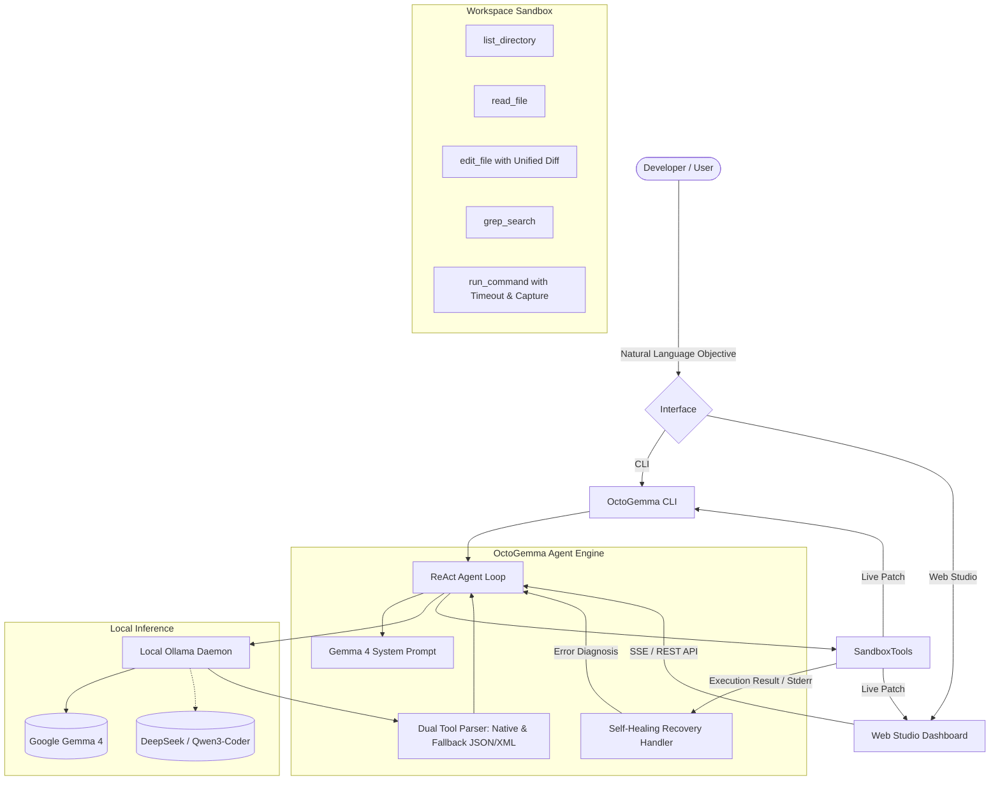

# OctoGemma

> Privacy-First Autonomous Coding & Self-Healing Agent powered by Google Gemma 4.

Built for **Hacktoberfest Hack Day — Coimbatore 2026**, organized by **INIT CLUB × iDEA CLUB** in collaboration with **Major League Hacking (MLH)**.

---

## Team

**Team Name:** Commit Cruisers

| Member | Role / Focus Area | Key Contributions |
| ------ | ----------------- | ----------------- |
| **Vijay Raghav** | Core Architecture & Agent Logic | ReAct Loop, Self-Healing Recovery, Agent Orchestration, Tool Dispatching |
| **Nikkil Prithvin** | Frontend & LLM Integration | Roo Code Web Studio, SSE Streaming, llama.cpp/Ollama Bridge, Model Management, Fallback Parser |
| **Dwaragesh** | Sandbox Tools & Execution | File Operations, Terminal/Git Tools, Unified Diff Engine, Safe Workspace Execution |
| **Astus Samuvel** | CLI, Testing & Infrastructure | CLI Interface, Benchmark Suite, Test Infrastructure, Config System, Documentation, Demo Scenarios |
---

## Problem Statement

### The Problem
Modern software development increasingly relies on cloud-hosted AI coding assistants. However, this creates severe bottlenecks for developers and organizations:
1. **Intellectual Property & Privacy Exposure:** Proprietary source code and internal company schemas are continuously uploaded to third-party cloud servers.
2. **Context Amnesia & Hallucinated Fixes:** Generic LLMs often propose code changes without inspecting the workspace or testing them against existing test suites.
3. **Manual Verification Burden:** Developers must manually test proposed patches, diagnose terminal errors, and iterate back-and-forth when a fix breaks existing tests.

### Why We Chose This Problem
Developers need an agent that operates with true autonomy: one that doesn't just suggest text, but actually explores files, applies surgical patches, executes unit tests, captures tracebacks, and self-repairs until all assertions pass—all running 100% locally on workstation hardware without cloud dependency or token costs.

---

## Solution

**OctoGemma** is an autonomous, privacy-first software engineering agent designed to run entirely locally using **Google Gemma 4** (specifically optimized for `gemma4:e4b` and `gemma4:12b` via Ollama).

OctoGemma features an automated **ReAct + Self-Healing Execution Loop**:
1. **Explore:** Scans workspace directory trees and searches codebases with pattern/regex grep.
2. **Reason:** Conducts chain-of-thought analysis to diagnose bugs or plan feature additions.
3. **Act:** Applies non-destructive file edits using exact string matching and diff generation.
4. **Verify:** Runs test suites, linters, or build scripts in a sandboxed subshell.
5. **Self-Heal:** If assertions fail or errors arise, the agent reads stderr and stack traces, diagnoses the root cause, and autonomously iterates until verification succeeds.

### Key Features
- **Dual Interface:**
  - **OctoGemma Web Studio:** A glassmorphic web dashboard with real-time streaming agent thoughts, file tree explorer, unified diff viewer, integrated terminal output, model switcher, and one-click benchmark scenarios.
  - **OctoGemma CLI:** An interactive, terminal UI powered by `rich` and `typer` with colored diffs and progress streaming.
- **Native Gemma 4 Integration:** Tailored system prompts and structured tool calling designed for Google Gemma 4's reasoning architecture, with fallback support for other local models (`deepseek-coder-v2`, `qwen3-coder`).
- **Autonomous Self-Healing:** Automatic detection of test failures with iterative re-patching and regression prevention.
- **Sandboxed Workspace Execution:** Protected path resolution preventing directory traversal outside the target workspace.
- **Real-Time Event Streaming:** Server-Sent Events (SSE) providing transparent visibility into every reasoning step and tool invocation.

---

## Innovation and Differentiation

| Capability | Conventional Cloud AI Assistants | OctoGemma |
| :--- | :--- | :--- |
| **Privacy & Security** | Code transmitted to external cloud APIs | 100% offline & local via Ollama |
| **Verification Loop** | Static text suggestions; manual user testing | Autonomous terminal execution and test validation |
| **Failure Recovery** | User must manually paste error tracebacks | Built-in self-healing loop that reads stderr and re-attempts |
| **Model Engine** | Proprietary cloud LLMs | Google Gemma 4 open weights |
| **User Surface** | Text chat or basic editor plugin | Dual Interface: Interactive CLI & Real-time Web Studio |

---

## Technical Implementation

### Architecture



### Technology Stack

| Category | Technologies |
| :--- | :--- |
| Frontend | Vanilla HTML5, Vanilla CSS3 (Custom Dark Theme & Glassmorphism), Modern ES6 JavaScript |
| Backend | Python 3.14+, FastAPI, Starlette, Uvicorn (ASGI) |
| CLI | Typer, Rich |
| AI / LLM | Google Gemma 4 (`gemma4:e4b` / `gemma4:12b`), Ollama local server |
| Protocol | Server-Sent Events (SSE), REST, JSON Schema |
| Testing | Pytest |
| Infrastructure | 100% Local Workstation (NVIDIA RTX GPU / CPU) |

### How It Works
1. **Initiation:** The user supplies a coding objective either via the web interface (`http://127.0.0.1:8000`) or the CLI (`python run_cli.py run "<task>"`).
2. **Context Exploration:** The agent invokes `list_directory` and `read_file` to inspect the project layout without loading unneeded files into memory.
3. **Execution Plan:** Gemma 4 generates a step-by-step chain-of-thought explaining the planned changes.
4. **Patch Application:** Using `edit_file`, the agent replaces exact blocks of code, generating a standard unified diff that updates the real-time diff viewer.
5. **Validation & Self-Healing:** The agent executes verification commands (such as `pytest`). If an exit code is non-zero, the `self_healing_triggered` pipeline is activated: the error output is fed back into the agent context, prompting Gemma 4 to formulate an alternate patch and re-test until all checks pass.
6. **Task Completion:** Once assertions succeed, the agent calls `finish_task` and returns a summary of verified modifications.

### Technical Decisions
- **Local-First Architecture:** By using Ollama with Google's Gemma 4 family, developers maintain complete privacy over their codebases.
- **Dual Tool Parser:** Quantized local models occasionally output function calls as markdown blocks or XML rather than raw JSON schemas. OctoGemma's parsing pipeline supports both native Ollama function calling and regex-based fallback extraction, ensuring consistent execution.
- **Exact Block Search-and-Replace:** Rather than rewriting entire files (which risks hallucinating deleted functions), `edit_file` performs targeted block replacements with strict uniqueness validation.

---

## Implementation During the Hackathon

During the hackathon, the following components were conceived and built:
- **Core Agent Engine (`src/octogemma/agent.py`):** Built the complete ReAct loop, tool dispatching mechanism, and self-healing error recovery logic.
- **Ollama Gemma 4 Bridge (`src/octogemma/llm.py`):** Implemented client communication, model health checks, dynamic fallback detection, and streaming model downloads.
- **Sandboxed Tool Suite (`src/octogemma/tools.py`):** Developed safe workspace tools including directory traversal, scoped file reading, regex grep, block editing with unified diffs, and timeout-protected command execution.
- **Interactive CLI (`src/octogemma/cli.py`):** Created a rich terminal interface with animated spinners, colored status cards, syntax-highlighted diffs, and interactive chat modes.
- **Web Studio Dashboard (`src/octogemma/web/` & `src/octogemma/server.py`):** Designed and implemented an interactive web UI featuring real-time SSE streaming, live diff viewer, terminal emulator, and workspace explorer.
- **Benchmark Demo Suite (`examples/demo_repo/`):** Created a reproducible test suite (`math_service.py` and `test_math_service.py`) demonstrating autonomous bug detection, code patching, and self-healing test verification.
- **Automated Test Suite (`tests/`):** Wrote unit tests for both sandbox tools and agent fallback parsers.

---

## Working Application

**Local Web Studio URL:** `http://127.0.0.1:8000`

The application runs locally and provides:
1. An interactive dashboard to launch and monitor autonomous coding workflows.
2. Real-time visualization of agent thoughts, tool calls, and test results.
3. Unified diff viewer showing exact additions and deletions.
4. Model selector supporting Gemma 4 variants and local fallback models.

---

## Demo Video

**Demo Video:** [https://youtu.be/placeholder-hacktoberfest-octogemma](https://youtu.be/placeholder-hacktoberfest-octogemma)

The demo illustrates:
1. Launching the Web Studio and inspecting the local Ollama status.
2. Selecting the **"Fix Math Service & Pass Tests"** benchmark scenario.
3. Gemma 4 exploring the workspace, discovering the failing tests in `examples/demo_repo`, and inspecting `math_service.py`.
4. Generating targeted patches with live diffs.
5. Executing `pytest`, detecting failures, self-healing the logic, and verifying a 100% test pass rate.

---

## Open Source and AI Usage

### AI / Models
- **Google Gemma 4 (`gemma4:e4b` / `gemma4:12b`):** Google's open-weights model family utilized for reasoning, code comprehension, tool invocation, and error diagnosis.
- **Fallback Models:** `deepseek-coder-v2:16b-lite-instruct-q4_0` and `qwen3-coder:30b-a3b-q4_K_M` for local development redundancy.

### Open Source Components
- **Ollama:** Open-source local LLM runner providing the HTTP REST API.
- **FastAPI & Uvicorn:** High-performance asynchronous web framework and ASGI server.
- **Rich & Typer:** Terminal UI rendering and CLI structure.
- **Pytest:** Testing framework used for verification loops and benchmark evaluation.

---

## Setup and Usage

### Prerequisites
- **Python 3.10+** (Python 3.14+ recommended)
- **Ollama** installed and running (`ollama serve`)
- Recommended hardware: NVIDIA GPU (8GB+ VRAM) or Apple Silicon / 16GB+ RAM

### Installation

```bash
git clone https://github.com/your-username/hacktoberfest-hack-day-coimbatore-x-init-club-and-idea-club.git
cd hacktoberfest-hack-day-coimbatore-x-init-club-and-idea-club

# Install Python dependencies
pip install -r requirements.txt
```

### Environment Variables

Copy `.env.example` to `.env`:

```bash
cp .env.example .env
```

Default configuration in `.env`:
```env
OLLAMA_BASE_URL=http://localhost:11434
OCTOGEMMA_MODEL=gemma4:e4b
OCTOGEMMA_MAX_STEPS=25
OCTOGEMMA_TIMEOUT_SECONDS=120
OCTOGEMMA_WORKSPACE=.
WEB_HOST=127.0.0.1
WEB_PORT=8000
```

### Pull Gemma 4

Ensure your Ollama server is running, then pull Gemma 4:

```bash
# Using OctoGemma CLI
python run_cli.py pull gemma4:e4b

# Or directly with Ollama
ollama pull gemma4:e4b
```

### Running the Project

#### Option 1: Web Studio (Recommended)
```bash
python run_web.py
```
Open [http://127.0.0.1:8000](http://127.0.0.1:8000) in your web browser.

#### Option 2: CLI Mode
```bash
# Run a specific autonomous task
python run_cli.py run "Inspect examples/demo_repo, run pytest, fix the bugs in math_service.py, and verify tests pass"

# Start an interactive CLI chat session
python run_cli.py chat

# List local models
python run_cli.py models
```

#### Running Tests
```bash
python -m pytest tests/
```

---

## Challenges and Learnings

1. **Tool-Calling Reliability Across Local Quantizations:** Smaller quantized open models can occasionally deviate from strict JSON schemas. We resolved this by building a dual parsing engine that handles both native Ollama function schemas and XML/Markdown fallback representations.
2. **Infinite Self-Healing Loops:** Early iterations risked oscillating between broken fixes. We implemented strict loop limits, failure tracking, and error retrospection prompts to guide the agent toward root-cause resolution.
3. **Low-Latency Streaming:** Coordinating asynchronous tool execution, shell commands, and real-time UI updates was achieved using Server-Sent Events (SSE), ensuring responsive feedback without UI blocking.

---

## Credits and License

### Credits
- Google DeepMind for the **Gemma 4** open-weights model family.
- The **Ollama** team for local model serving.
- Organizers: **INIT CLUB × iDEA CLUB** and **Major League Hacking (MLH)** for Hacktoberfest Hack Day Coimbatore 2026.

### License
This project is licensed under the [MIT License](LICENSE).

---

## Submission Checklist

- [x] Project title and description added
- [x] All team members listed
- [x] Problem clearly explained
- [x] Reason for choosing the problem explained
- [x] Solution and key features documented
- [x] Innovation and differentiation explained
- [x] Architecture included
- [x] Technical implementation documented
- [x] Work completed during the hackathon documented
- [x] Team contributions documented
- [x] Working application is functional
- [x] Live application link added where applicable
- [x] Demo video added
- [x] AI and open-source components documented
- [x] Setup and usage instructions tested
- [x] Challenges and learnings documented
- [x] Credits added
- [x] License added
- [x] Repository is organized and complete
